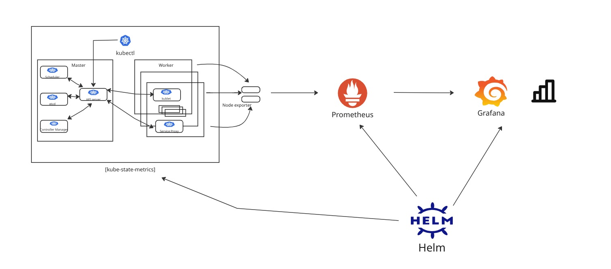
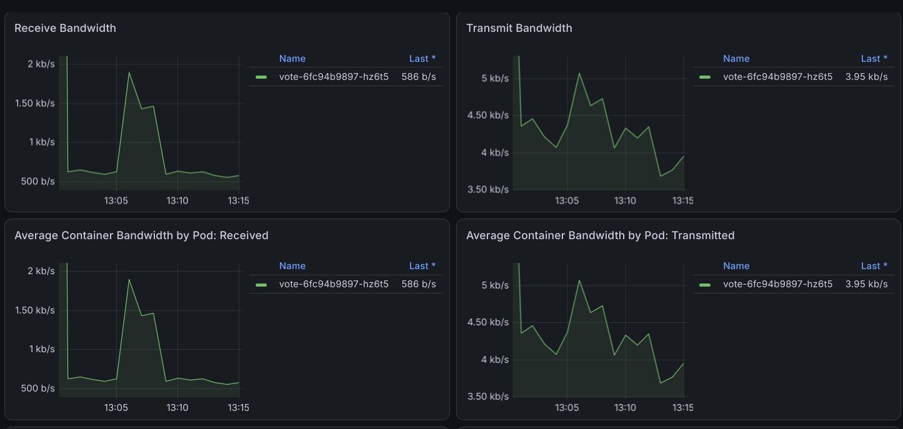

# Voting App on Kubernetes with Prometheus & Grafana Monitoring

A containerized voting application deployed on Kubernetes, instrumented end-to-end with a production-style observability stack. The cluster's node and workload metrics are scraped by Prometheus and visualized through Grafana dashboards, with Helm used to package and manage the monitoring stack.

<p align="left">
  
  
  
  
  
</p>

---

## Table of Contents

- [Overview](#overview)
- [Architecture](#architecture)
- [Tech Stack](#tech-stack)
- [Repository Structure](#repository-structure)
- [Prerequisites](#prerequisites)
- [Getting Started](#getting-started)
  - [1. Clone the Repository](#1-clone-the-repository)
  - [2. Set Up the Kubernetes Cluster](#2-set-up-the-kubernetes-cluster)
  - [3. Deploy the Voting App](#3-deploy-the-voting-app)
  - [4. Install the Monitoring Stack with Helm](#4-install-the-monitoring-stack-with-helm)
  - [5. Access the Services](#5-access-the-services)
- [Grafana Dashboards](#grafana-dashboards)
- [Monitoring Design](#monitoring-design)
- [Troubleshooting](#troubleshooting)
- [Contributing](#contributing)
- [Contact](#contact)

---

## Overview

This project demonstrates a complete DevOps workflow for deploying and observing a stateful, multi-service application on Kubernetes:

- The **voting application** is deployed as a set of Kubernetes workloads (Deployments/Services) managed by the cluster's control plane and scheduled across worker nodes.
- **Exporters** (node-exporter, kube-state-metrics) run alongside the application to expose infrastructure- and workload-level metrics in Prometheus format.
- **Prometheus** scrapes, stores, and queries those metrics via PromQL.
- **Grafana** connects to Prometheus as a data source and renders the metrics as dashboards.
- **Helm** is used to deploy and manage both Prometheus and Grafana as versioned, repeatable releases rather than hand-rolled manifests.

The goal of this repository is to provide a hands-on, reproducible reference for standing up application monitoring on Kubernetes using industry-standard tooling.

## Architecture

<p align="center">
  
</p>

**Flow summary:**

1. The Kubernetes **master** (API server, etcd) schedules the voting app and monitoring components onto **worker nodes**.
2. Each worker node runs **kubelet** and metric **exporters** (node-exporter for host-level metrics, kube-state-metrics for Kubernetes object state).
3. **Prometheus** periodically scrapes those exporters, stores the resulting time-series data, and exposes it for querying via PromQL.
4. **Grafana** is configured with Prometheus as a data source and renders the scraped metrics as dashboards.
5. **Helm** owns the lifecycle of both Prometheus and Grafana, installing them as charts and managing upgrades/rollbacks as a single release.

## Tech Stack

| Layer | Tool |
|---|---|
| Container orchestration | Kubernetes |
| Package management | Helm |
| Metrics collection | Prometheus, node-exporter, kube-state-metrics |
| Visualization | Grafana |
| Containerization | Docker |
| Application | Voting app services (vote / worker / result) |

## Repository Structure

```
.
├── voting-app/              # Application source and Dockerfiles for each microservice
├── k8s/                     # Kubernetes Deployment/Service/Namespace manifests for the app
├── get_helm.sh              # Helm values files for the Prometheus & Grafana stack
├── dashboards/              # Grafana dashboard JSON exports (if provisioned)
├── docs/                    # Architecture diagram and supporting documentation
└── README.md
```

> Adjust the tree above to match the actual folder names in the repository.

## Prerequisites

Make sure the following are installed and available on your `PATH`:

- [Docker](https://docs.docker.com/get-docker/)
- A Kubernetes cluster — local (Minikube, Kind, k3d) or cloud-managed (EKS, GKE, AKS)
- [kubectl](https://kubernetes.io/docs/tasks/tools/)
- [Helm 3+](https://helm.sh/docs/intro/install/)
- `git`

## Getting Started

### 1. Clone the Repository

```bash
git clone https://github.com/Roay-Abdullah/Voting-App-using-K8s-Prometheus-Grafana.git
cd Voting-App-using-K8s-Prometheus-Grafana
```

### 2. Set Up the Kubernetes Cluster

If you don't already have a cluster running:

```bash
# Example using Minikube
minikube start --cpus=4 --memory=6g
```

Verify the cluster is up:

```bash
kubectl get nodes
```

### 3. Deploy the Voting App

```bash
kubectl create namespace voting-app
kubectl apply -f k8s-manifests/ -n voting-app
kubectl get pods -n voting-app -w
```

### 4. Install the Monitoring Stack with Helm

Add the Prometheus community Helm repository and install the stack:

```bash
helm repo add prometheus-community https://prometheus-community.github.io/helm-charts
helm repo update

helm install monitoring prometheus-community/kube-prometheus-stack \
  --namespace monitoring \
  --create-namespace \
  -f helm/values-monitoring.yaml
```

Confirm all monitoring pods are running:

```bash
kubectl get pods -n monitoring
```

### 5. Access the Services

Port-forward each service locally to reach it from your browser:

```bash
# Voting app
kubectl port-forward svc/vote -n voting-app 5000:80

# Prometheus
kubectl port-forward svc/monitoring-kube-prometheus-prometheus -n monitoring 9090:9090

# Grafana
kubectl port-forward svc/monitoring-grafana -n monitoring 3000:80
```

| Service | URL | Default Credentials |
|---|---|---|
| Voting App | http://localhost:5000 | — |
| Prometheus | http://localhost:9090 | — |
| Grafana | http://localhost:3000 | `admin` / (see Helm values or `kubectl get secret`) |

To retrieve the Grafana admin password if it was auto-generated:

```bash
kubectl get secret monitoring-grafana -n monitoring \
  -o jsonpath="{.data.admin-password}" | base64 --decode
```

## Grafana Dashboards

Once logged into Grafana:

1. Confirm Prometheus is registered under **Connections → Data sources**.
2. Import the recommended community dashboards (or the ones in `dashboards/`), for example:
   - **Kubernetes Cluster Monitoring** (node CPU/memory/disk)
   - **Kubernetes Pods** (per-pod resource usage)
   - **Kube-state-metrics** (deployment/replica health)
3. Optionally build a custom dashboard tracking voting app-specific metrics (request rate, pod restarts, vote throughput).

### Dashboard Previews

<p align="center">
  
  <br>
  <em>Bandwidth Monitoring — Receive/Transmit metrics per pod</em>
</p>

<p align="center">
  
  <br>
  <em>CPU Usage — Per-pod CPU consumption over time</em>
</p>

## Monitoring Design

- **node-exporter** runs as a DaemonSet, exposing host-level metrics (CPU, memory, disk, network) from every worker node.
- **kube-state-metrics** exposes the state of Kubernetes objects (deployments, pods, replica sets) as Prometheus metrics.
- **Prometheus** scrapes both sources on a configurable interval and retains the resulting time series, queryable via PromQL.
- **Grafana** is pre-wired to Prometheus as its data source, so dashboards update automatically as new metrics are scraped.
- **Helm** manages Prometheus and Grafana as a single `kube-prometheus-stack` release, making upgrades, rollbacks, and configuration changes (via `values.yaml`) reproducible.

## Troubleshooting

| Issue | Likely Cause | Fix |
|---|---|---|
| Pods stuck in `Pending` | Insufficient cluster resources | Increase CPU/memory allocated to the cluster |
| Grafana shows "No data" | Prometheus data source misconfigured | Check the data source URL matches the Prometheus service name/namespace |
| `helm install` fails | Stale or missing repo index | Run `helm repo update` before installing |
| Exporters not scraped | Missing `ServiceMonitor`/scrape annotations | Verify `ServiceMonitor` labels match the Prometheus Operator's selector |


## Contributing

Contributions are welcome. To contribute:

1. Fork the repository
2. Create a feature branch (`git checkout -b feature/your-feature`)
3. Commit your changes (`git commit -m "Add your feature"`)
4. Push to the branch (`git push origin feature/your-feature`)
5. Open a Pull Request


## Contact

**Roay Muhammad Abdullah**
GitHub: [@Roay-Abdullah](https://github.com/Roay-Abdullah)
